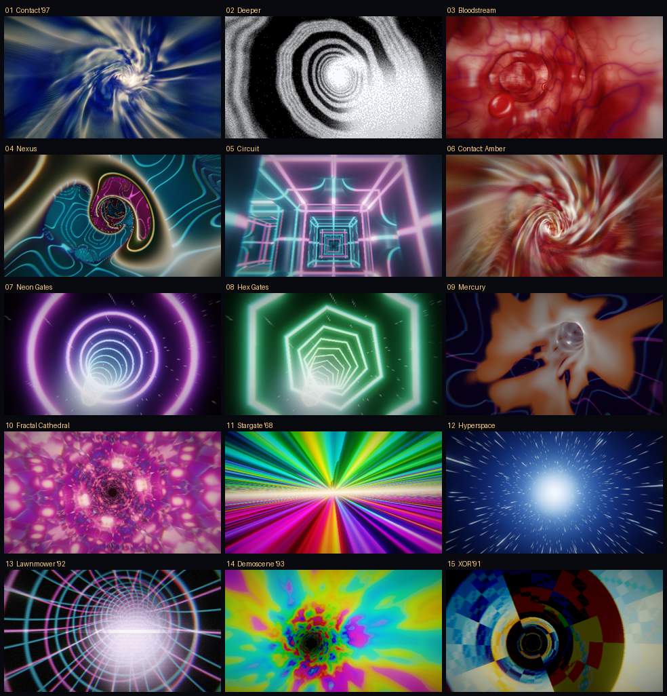
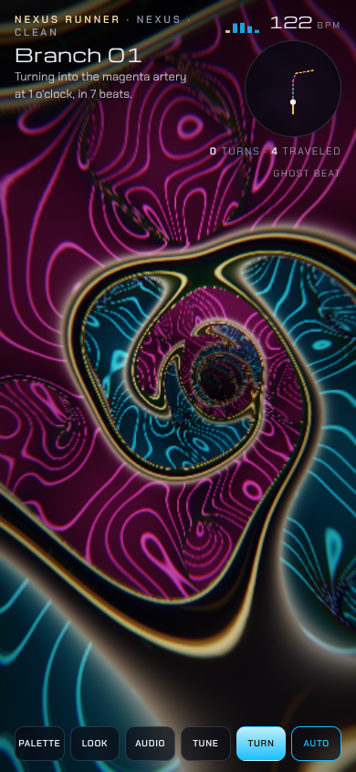

# Wormhole Lab



Audio-reactive tunnel visuals for DJ sets, built around the 1997 *Contact* wormhole ride (Weta Digital) and a dithered "we must go deeper" spiral GIF. One self-contained WebGL2 page with no build step and no dependencies.

## Run it

- **Hosted:** open the published page. Load a track from the Audio panel, or drop an audio file anywhere on the page.
- **Locally, with mic or line-in:** browsers only allow the mic on a secure origin, so serve the folder instead of double-clicking the file:

  ```sh
  cd wormhole-lab && python3 -m http.server 8000
  # then open http://localhost:8000 and press "Use mic or line-in"
  ```

## What's in it

**15 tunnel modes:** Contact '97, Deeper, Bloodstream, Nexus, Circuit, Contact: Amber, Neon Gates, Hex Gates, Mercury, Fractal Cathedral, Stargate '68, Hyperspace, Lawnmower '92, Demoscene '93, XOR '91.

- *Contact '97 / Amber*: a volumetric raymarch through domain-warped fractal noise, streaked along the direction of travel, with ridged-noise "lightning".
- *Bloodstream / Circuit*: a real 3D maze. The shader carves tubes on a lattice using a hash, and a JavaScript random walk runs the same hash (`segOpen` ↔ `segR`), so the camera only turns into tubes that are actually open.
- *Nexus*: the main tunnel cuts through both labyrinths of a gyroid, so side passages weave around it everywhere.

**7 looks**, any of which works with any mode: Clean, Film '97, GIF dither (blue-noise stipple, like the screenshot), 1-bit, VHS, Thermal, Acid.

**Membrane punch-through:** a rippling sheet of liquid light (or mirror, or grid) spans the tunnel, rushes at the camera and bursts with a flash and a shockwave. It fires on Punch, every N bars, on detected drops, and between modes in Auto VJ.

**Audio:** kick detection uses spectral flux on 35–130 Hz with an adaptive threshold, and the BPM is the median of the gaps between kicks. Each band has its own auto-gain. The kick drives speed surges, flashes and light waves; the sub makes the walls breathe; hats add sparkle. A 122 BPM ghost beat keeps things moving when nothing is playing.

## Nexus Runner (`nexus.html`)



A visualizer built only around the Nexus tunnel. You ride a tunnel whose walls are full of side arteries, and at random moments the camera turns down one of them. The artery widens around you into a full new tunnel with its own side arteries, and the old tunnel closes up behind you. It never goes back. It just keeps branching.

- **It turns into the arteries you can see.** The side arteries are the two labyrinths of a gyroid, and their junctions sit at odd multiples of π/4, where g = ±1.5. To turn, the planner picks a junction just outside the tunnel wall that it can reach in a straight line, threads 0–3 more junctions, then starts a new tunnel ("leg") along the next artery edge and grows its radius from zero to full.
- **Timing:** Random (a turn every 4–20 s, the default), Rare (10–40 s), Often (4–9 s), or On the beat (every few bars, with each new branch opening on a kick; it falls back to Random when the kicks stop). Gaps are measured from one artery dive to the next. You can also turn with **Turn** or `Space`, or on the drop. Before each turn the chosen artery mouth pulses, and the status says where it is: "the cyan artery at 2 o'clock, in 3 beats".
- **Safe and smooth:** the JS planner uses the same distance field as the shader. Across about 60 simulated minutes at 0.25×–3× speed and every artery width, the camera stayed at least 0.26 units from any wall (more with the artery widening), no turn was under 40° or over 120°, and nothing ran parallel to or doubled back into the old tunnel. It brakes through turns: about 70°/s typical and about 100°/s peak at triple speed.
- **Runs for hours:** the GPU world is rebased by whole gyroid periods, and long tunnels are re-origined every 240 units, so values stay small after hours of play.
- **HUD:** a "BRANCH 08" card on each turn (can be switched off), a heading-up route map with the next turn dashed, the turn count and distance traveled, 5 palettes, the same 7 looks as the Lab, and the same audio engine.

**Nexus Runner keys:** `Space` turn · `A` auto turns · `P` palette · `L` look · `↑` `↓` speed · `H` hide · `F` fullscreen · drag to look around · tap to hide or show the controls.

## Keys (Wormhole Lab)

`Space` punch through · `←` `→` change mode · `1`–`9` jump to a mode · `L` cycle looks · `A` toggle Auto VJ · `H` hide controls · `F` fullscreen · drag to look around · tap to hide or show the controls.

Quality is adaptive: the scene renders at a reduced resolution that scales with the measured frame rate, then gets upscaled. You can pin Low, Medium or High in Tune.
